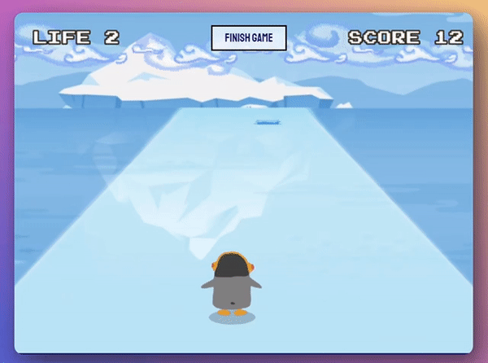
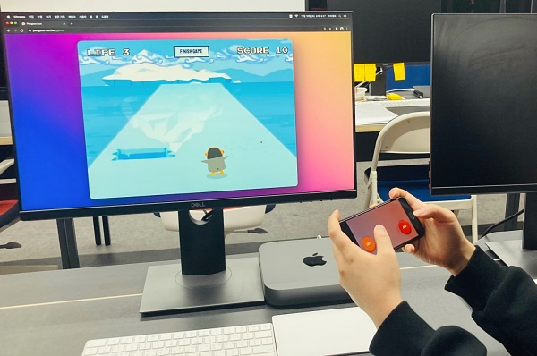

# 🐧 Pengsoo Run

  
  

**펭수런**은 Canvas 위에서 펭수와 함께 쉬지않고 달리는 웹 게임입니다.

게임화면과 게임패드를 각각 **다른 디바이스를 사용하여 플레이**하도록 하여 추억의 팩 게임을 연상시킬 수 있게끔 구현하였습니다. 최대 3인까지 멀티플레잉이 가능하지만 각 플레이어마다 펭수를 컨트롤 하는 역할만 다르게 부여되므로 모든 플레이어는 한마음이 되어야 합니다.

> 🔗 Deploy Site :  [https://pengsoo-run.live/](https://pengsoo-run.live/)

> 🔗 Play Video :  [https://youtu.be/qQbZtCGF5fU](https://youtu.be/qQbZtCGF5fU)

 

## 🚀 바로가기

- 💡 [기획 동기](#-%EA%B8%B0%ED%9A%8D%EB%8F%99%EA%B8%B0)
- 🛠 [기술 스택](#-%EA%B8%B0%EC%88%A0%EC%8A%A4%ED%83%9D)
- 📆 [프로젝트 기간](#-%ED%94%84%EB%A1%9C%EC%A0%9D%ED%8A%B8%EA%B8%B0%EA%B0%84)
- 📌 [주요 기능](#-%EC%A3%BC%EC%9A%94-%EA%B8%B0%EB%8A%A5)
- 🎯 [WHY (About Tech Stack)](#-why-about-tech-stack)
- 🌊 [위기상황](#-%EC%9C%84%EA%B8%B0%EC%83%81%ED%99%A9)

 

## 💡 기획동기

많은 사람들이 한번쯤은 해보았던 추억의 팩게임, **남극탐험**을 Canvas를 활용하여 만들어 보고싶었습니다.  
하지만 단순히 PC의 키보드나 마우스를 이용해서 플레이한다면 예전 그 팩게임의 향수를 느낄 수 없다고 생각했습니다. 그래서 플레이 화면은 PC 브라우저에 띄우더라도, 게임패드를 모바일에 구현해서 **원격으로 펭수를 조종**할 수 있다면 어떨까 생각하게 되었습니다.  
또한 마치 2인3각처럼 여럿이서 한 캐릭터를 움직이도록 하여 멀티플레잉적인 요소도 추가해보고자 하였습니다.

 

## 🛠 기술스택

**프론트엔드**

- TypeScript
- React
- Redux (Redux-toolkit)
- Phaser
- Socket.io Client
- Styled-components

**백엔드**

- TypeScript
- NestJS
- Redis
- Socket.io

 

## 📆 프로젝트기간

- **기획 :** 2020/11/30 ~ 2020/12/06 **(1주간)**
    - **1주차** 아이디어 및 기술스택 검토

- **개발 :** 2020/12/07 ~ 2020/12/19 **(2주간)**
    - **2주차** `Phaser` Game Scene + Object
    - **3주차** `React` UI  / `Socket` 원격 조종

 

## 📌 주요 기능

|||
|:---:|:---:|
| 플레이어 수에 맞게 게임 모드를 선택할 수 있습니다.  | 모바일에서 QR코드를 이용해 게임패드 페이지로 접속 할 수 있습니다. 유저 연결 성공 시 활성화 된 역할에 불이 들어옵니다.|
| 모든 플레이어가 접속한 경우 `GAME START` 버튼이 활성화 됩니다.  | 모바일 상에서는 플레이어의 역할에 맞게 버튼이 보여집니다. 실시간으로 현재 게임 진행상황을 알 수 있습니다.|
| 모바일에서 버튼을 눌러 펭수를 조종할 수 있습니다. 물웅덩이나 북극곰과 충돌 시, 라이프가 소진됩니다. 일정 스코어에 도달 시, 게임속도가 빨라집니다.| 펭수의 라이프가 모두 소진되면 게임오버 됩니다.|

 

## 🎯 WHY (About Tech Stack)

> 이번 펭수런 프로젝트에서는 지금껏 부트캠프 기간 동안 사용한 적 없는 새로운 테크스택을 많이 도입했습니다.  
3주라는 짧은 시간이 주어진 프로젝트였기 때문에 이러한 테크스택을 도전적으로 도입하려면 타당한 근거가 뒷받침되어야 했습니다.  
그러한 고민과 결론에 대해서 기록을 남겨보았습니다.

**Why TypeScript?**

아무래도 게임은 좌표나 속도 등 수많은 값들이 각 메소드들 간을 넘나들어야 하므로, 예측 불가능한 타입이 넘어올 경우 오류가 발생하기 쉽습니다.  
게다가 펭수런 프로젝트는 게임 흐름에 소켓이벤트까지 포함되기 때문에 촘촘하게 로직을 짜지 않으면 언제 어떤 인자가 잘못 넘어와서 오류가 났는지 디버깅하기 어려울 것 같다는 생각이 들었습니다. 그래서 타입스크립트를 도입하게 되었습니다.  
일단 다른 것 보다도 프로젝트 전체를 돌아봤을 때, 런타임 중에 에러가 발생하는 걸 거의 본적이 없었다는 게 정말 신선한 충격이었습니다.  
물론 타입스크립트가 처음이다 보니 문법을 익히는 시간이 무지막지하게 소요되었지만, 그래도 디버깅에 소요한 시간 또한 굉장히 줄었습니다.  
하지만 로직이 머릿속에 전부 구현이 되었어도, 타입스크립트에 익숙하지 못해서 원하는 코드를 쓰지 못한 경우도 여럿 있었습니다. 타입스크립트를 제 입맛에 맞게 사용할 수 있었다면 좀 더 많은 기능을 추가할 수 있었지 않았을까 하는 아쉬움도 남았습니다.  

**Why Phaser?**

Phaser는 HTML5의 WebGL과 Canvas를 활용하는 2D 게임 프레임워크입니다.  
펭수런 프로젝트의 핵심기능은 `Canvas와 requestAnimationFrame을 활용한 게임 자체`에 대한 구현과 `소켓을 통한 실시간 원격 조종`에 있었습니다.  
사실 Canvas자체만을 사용하여 구현할 수도 있었는데도 불구하고 프레임워크를 도입한 이유는, 짧은 시간 내에 게임 자체 뿐만 아니라 원격조종 또한 구현했어야 했기 때문입니다.  
따라서 펭수 모션에 따른 애니메이션이나 충돌 시 카메라 흔들림, 배경의 반복 렌더링과 같이 시간이 오래 걸릴 것 같은 부수적인 부분은 프레임워크의 도움을 받았습니다.  

**Why NestJS?**

NodeJS를 사용하게 되면 아무래도 자유도가 높기 때문에 여러 가지 아키텍처를 도입할 수 있습니다. 하지만 아직 서버 쪽 지식이 많지 않다 보니 항상 보일러 플레이트를 사용해서 똑같은 흐름으로만 서버를 만들어왔습니다.  
물론 어떤 아키텍처가 답이냐 하는 건 없겠지만 저는 그래도 그런 부분이 답답했었습니다. 정답은 없다 하더라도 항상 더 효율적인 것은 존재하기 때문입니다. 그래서 NestJS처럼 어느 정도 구조가 잡혀있다면 원하는 기능구현이 더 빠르고 확실하게 될 수 있다고 생각했습니다.  
또한 Phaser, NestJS 둘 다 타입스크립트에 굉장히 친화적인 프레임워크이다보니 프로젝트를 세팅하는 과정도 수월했습니다.  

 

## 🌊 위기상황

**리덕스 커스텀 미들웨어 만들기**

API요청이나 소켓이벤트와 같은 사이드 이펙트가 리덕스 액션과 얽힐 경우 리듀서를 순수하게 유지하기 위해서 리덕스 미들웨어가 미리 액션을 만나서 어떤 작업을 할 수 있다는 건 알고 있었지만 그걸 직접 구현해 본 적은 없었습니다.  
펭수런 프로젝트는 모두 소켓을 통해 상태변화가 이루어지므로 이러한 로직을 커스텀 미들웨어에 주입해서, 특정 액션이 발생했을 때 그 액션을 인터셉트해서 소켓 리스너를 켜고 끄거나, 서버에 소켓이벤트를 emit하는 등의 작업을 하도록 구현해보았습니다.  
하지만 타입스크립트를 사용하다 보니 커스텀 미들웨어의 파라미터나 리턴 타입을 명시해야 했습니다. 리덕스의 타입선언 파일을 뜯어보았는데 아직 제네릭같은 문법에 익숙하지 않다 보니 이해하는 데에 시간이 오래 걸릴 수 밖에 없었습니다. 그러다보니 여러가지 미들웨어 라이브러리들을 참고하며 하나하나 완성해 나가야 했습니다.  
이렇게 리덕스를 낱낱이 해체하면서 미들웨어를 만들다 보니, 지금껏 Logger, Thunk, Saga와 같은 미들웨어들의 핵심 로직을 잘 알지 못한 채 추상화된 인터페이스에만 맞추어 사용했다는걸 깨닫게 되었습니다. 하나의 store로 모든 상태를 관리한다는 게 어떤 의미인지 배웠고, 라이브러리의 사용하더라도 그 원리를 잘 이해한다면 개발자의 의지대로 기능을 구현할 수 있다는 걸 느꼈습니다.

**디펜던시 버전관리**

NestJS는 내부적으로 Socket io 플랫폼을 탑재하고 있습니다. 그래서 클라이언트 측에만 socket.io-client 라이브러리를 설치했는데 서버와의 소켓연결에서부터 계속해서 실패하고, 오류 메시지를 정말 쥐잡듯이 구글링했지만 원인을 찾지 못했습니다.  
그렇게 하루 꼬박 여기에만 시간을 쏟다가, NestJS의 깃헙 이슈페이지에서 원인을 찾게 되었습니다.  
Socket.io가 아주 최근에 version 3으로 메이저 업데이트를 진행했는데, 그러다 보니 클라이언트 측과 서버 측 버전이 맞지 않는 경우에 정상적으로 소켓통신을 하지 못하는 문제가 발생하게 된다고 합니다.  
그제야 부랴부랴 NestJS의 디펜던시를 살펴보니 socket.io 2.3.0 버전을 사용하고 있다는 걸 깨달았습니다. 그 후에 클라이언트 측의 버전을 맞추어 다운그레이드하자 정말 너무나도 멀쩡히 잘 작동되었습니다.  
사실 지금까지 그 많은 과제들과 프로젝트들을 하면서도 디펜던시 버전관리가 왜 중요한지 크게 와 닿은 적이 없었는데 이번 경험을 통해서 다시 한번 `package.json`이나 `package-lock.json`에 대해 공부하게 되었습니다.  
또 어떤 이슈를 맞닥뜨렸을 때 무조건 스택오버플로를 찾거나 구글링만 하기보다, 해당 라이브러리의 깃헙이슈페이지를 꼼꼼히 읽어봐야겠다고 다짐했습니다.  
